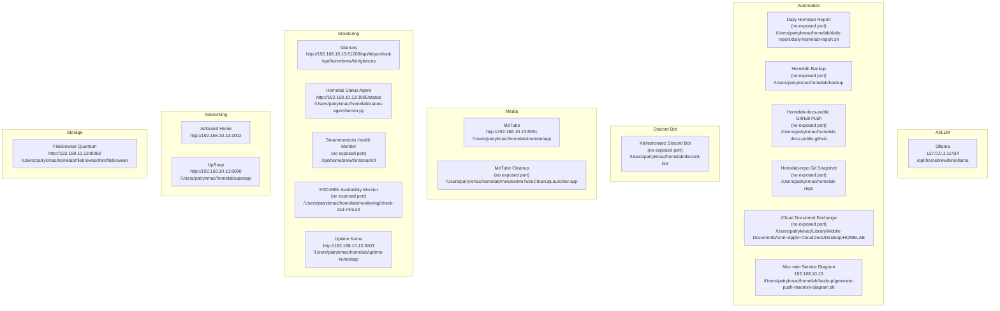

# Mac mini — Service Diagram

Auto-generated from `HOMELAB-MACMINI.md`'s service inventory by `generate-push-macmini-diagram.sh`. Do not edit by hand - it is overwritten on every run and only committed when its content changes.

