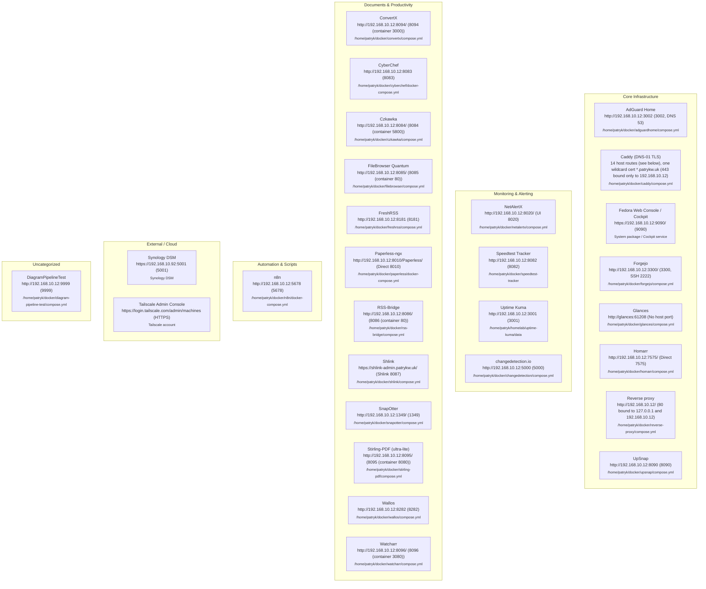

# miniPC Services

Auto-generated from the "Web services / dashboards" table in `HOMELAB.md`. Do not edit by hand.

```mermaid
flowchart TB
  subgraph core_infra["Core Infrastructure"]
    core_infra_adguard_home["AdGuard Home<br/>http://192.168.10.12:3002 (3002, DNS 53)<br/><sub>/home/patryk/docker/adguardhome/compose.yml</sub>"]
    core_infra_caddy_dns_01_tls["Caddy (DNS-01 TLS)<br/>14 host routes (see below), one wildcard cert *.patrykw.uk (443 bound only to 192.168.10.12)<br/><sub>/home/patryk/docker/caddy/compose.yml</sub>"]
    core_infra_fedora_web_console_cockpit["Fedora Web Console / Cockpit<br/>https://192.168.10.12:9090/ (9090)<br/><sub>System package / Cockpit service</sub>"]
    core_infra_forgejo["Forgejo<br/>http://192.168.10.12:3300/ (3300, SSH 2222)<br/><sub>/home/patryk/docker/forgejo/compose.yml</sub>"]
    core_infra_glances["Glances<br/>http://glances:61208 (No host port)<br/><sub>/home/patryk/docker/glances/compose.yml</sub>"]
    core_infra_homarr["Homarr<br/>http://192.168.10.12:7575/ (Direct 7575)<br/><sub>/home/patryk/docker/homarr/compose.yml</sub>"]
    core_infra_reverse_proxy["Reverse proxy<br/>http://192.168.10.12/ (80 bound to 127.0.0.1 and 192.168.10.12)<br/><sub>/home/patryk/docker/reverse-proxy/compose.yml</sub>"]
    core_infra_upsnap["UpSnap<br/>http://192.168.10.12:8090 (8090)<br/><sub>/home/patryk/docker/upsnap/compose.yml</sub>"]
  end
  subgraph monitoring["Monitoring & Alerting"]
    monitoring_netalertx["NetAlertX<br/>http://192.168.10.12:8020/ (UI 8020)<br/><sub>/home/patryk/docker/netalertx/compose.yml</sub>"]
    monitoring_speedtest_tracker["Speedtest Tracker<br/>http://192.168.10.12:8082 (8082)<br/><sub>/home/patryk/docker/speedtest-tracker</sub>"]
    monitoring_uptime_kuma["Uptime Kuma<br/>http://192.168.10.12:3001 (3001)<br/><sub>/home/patryk/homelab/uptime-kuma/data</sub>"]
    monitoring_changedetection_io["changedetection.io<br/>http://192.168.10.12:5000 (5000)<br/><sub>/home/patryk/docker/changedetection/compose.yml</sub>"]
  end
  subgraph docs_productivity["Documents & Productivity"]
    docs_productivity_convertx["ConvertX<br/>http://192.168.10.12:8094/ (8094 (container 3000))<br/><sub>/home/patryk/docker/convertx/compose.yml</sub>"]
    docs_productivity_cyberchef["CyberChef<br/>http://192.168.10.12:8083 (8083)<br/><sub>/home/patryk/docker/cyberchef/docker-compose.yml</sub>"]
    docs_productivity_czkawka["Czkawka<br/>http://192.168.10.12:8084/ (8084 (container 5800))<br/><sub>/home/patryk/docker/czkawka/compose.yml</sub>"]
    docs_productivity_filebrowser_quantum["FileBrowser Quantum<br/>http://192.168.10.12:8085/ (8085 (container 80))<br/><sub>/home/patryk/docker/filebrowser/compose.yml</sub>"]
    docs_productivity_freshrss["FreshRSS<br/>http://192.168.10.12:8181 (8181)<br/><sub>/home/patryk/docker/freshrss/compose.yml</sub>"]
    docs_productivity_paperless_ngx["Paperless-ngx<br/>http://192.168.10.12:8010/Paperless/ (Direct 8010)<br/><sub>/home/patryk/docker/paperless/docker-compose.yml</sub>"]
    docs_productivity_rss_bridge["RSS-Bridge<br/>http://192.168.10.12:8086/ (8086 (container 80))<br/><sub>/home/patryk/docker/rss-bridge/compose.yml</sub>"]
    docs_productivity_shlink["Shlink<br/>https://shlink-admin.patrykw.uk/ (Shlink 8087)<br/><sub>/home/patryk/docker/shlink/compose.yml</sub>"]
    docs_productivity_snapotter["SnapOtter<br/>http://192.168.10.12:1349/ (1349)<br/><sub>/home/patryk/docker/snapotter/compose.yml</sub>"]
    docs_productivity_stirling_pdf_ultra_lite["Stirling-PDF (ultra-lite)<br/>http://192.168.10.12:8095/ (8095 (container 8080))<br/><sub>/home/patryk/docker/stirling-pdf/compose.yml</sub>"]
    docs_productivity_wallos["Wallos<br/>http://192.168.10.12:8282 (8282)<br/><sub>/home/patryk/docker/wallos/compose.yml</sub>"]
    docs_productivity_watcharr["Watcharr<br/>http://192.168.10.12:8096/ (8096 (container 3080))<br/><sub>/home/patryk/docker/watcharr/compose.yml</sub>"]
  end
  subgraph automation["Automation & Scripts"]
    automation_n8n["n8n<br/>http://192.168.10.12:5678 (5678)<br/><sub>/home/patryk/docker/n8n/docker-compose.yml</sub>"]
  end
  subgraph external["External / Cloud"]
    external_synology_dsm["Synology DSM<br/>https://192.168.10.92:5001 (5001)<br/><sub>Synology DSM</sub>"]
    external_tailscale_admin_console["Tailscale Admin Console<br/>https://login.tailscale.com/admin/machines (HTTPS)<br/><sub>Tailscale account</sub>"]
  end
  subgraph uncategorized["Uncategorized"]
    uncategorized_diagrampipelinetest["DiagramPipelineTest<br/>http://192.168.10.12:9999 (9999)<br/><sub>/home/patryk/docker/diagram-pipeline-test/compose.yml</sub>"]
  end
```
